[繁體中文](README.tc.md) | [简体中文](README.sc.md) | [English](README.en.md) | [日本語](README.ja.md) | [한국어](README.ko.md)
Here is the English version intro, written by a human. 

# I Ching Notebook (Notebook for Book of Changes)

Unlike most I Ching apps/tools, I Ching Notebook, as its name suggests, is a dedicate browser app that allows users to add notes and even images to it, just like what you can do to a physical notebook. 

Features:

0. 🛜 Run Locally
1. 😎 [Interactive Hexagram Display](#1--interactive-hexagram-display)
2. 🎲 [Casting](#2--casting)
3. 📝 [Text Edit](#3--text-edit)
4. 🌠 [Inserting Images](#4--inserting-images)
5. 💾🔍 [Save & Reload Any Hexagram in 2 Clicks](#5--save--reload-any-hexagram-in-2-clicks)
6. 📚 [Complete I Ching Texts Built-in (64 Hexagrams + Ten Wings, except the Xi Ci Zhuan)](#6--complete-i-ching-texts-built-in)
7. 📄 [Import/Export Data](#7--importexport-data)
8. 🛠️ [Customisations](#8-️-customisations)
9. 📱 [Adapt to Any Window Sizes, Even on Mobile Phone](#9--on-mobile-phone)
10. ䷋䷊ [Hexagram Transformations](#10-䷋䷊-hexagram-transformations)

I Ching Notebook has only been tested on MacOS and iOS, and it is also my first ever broswer app project. Please feel free to give any feedback and let me know what new features you want to see in the future. 

Note that the app is MADE WITH CLAUDE CODE, so if you prefer an 100% made-by-human app, I am afraid it's not for you. 

Many thanks!

## Download

Option A: [ic_en.html](ic_en.html)

Recommend to try this ready-to-go version first. It has all the English contents embedded in the code. 

Option B: [ic.html](ic.html)

A lightweighted original version that does not have English contents embedded in the code, and therefore, you need to import the data yourself. Make sure you read the Feature Datails section and familar yourself with these features before downloading this version. 

In both cases, you also need to download the [assets](assets) folder to the same file location as the .html file so that the images can be loaded in the app.

## Feature Details

### 1. 😎 Interactive Hexagram Display
Simply click on the Yin/Yang symbol or the 6-digit buttons to construct the hexagram you want to look up seamlessly.

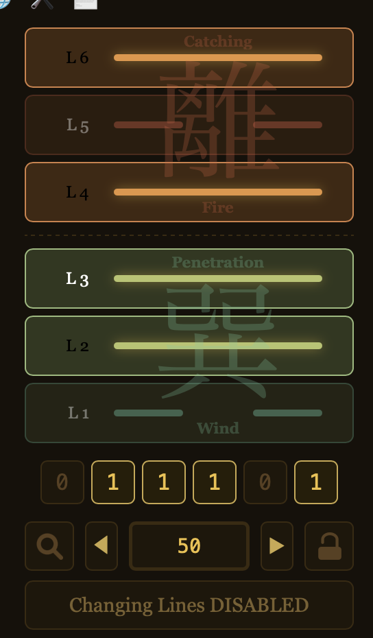
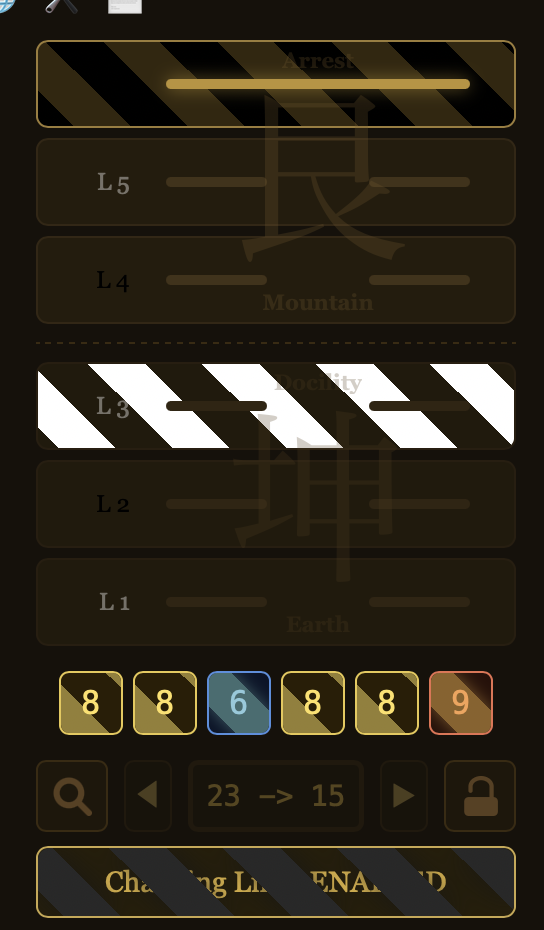

### 2. 🎲 Casting
Click the "Cast" button, give it a name, and click the button 6 more times, then the hexagram display will show the result automatically. You can choose either cast in binary mode (0s and 1s) or changing-line mode (6,7,8,9, which are Old Yin, Young Yang, Young Yin, Old Yang respectively, where Old Yins/Yangs produces changing lines). Remember to toggle the Changing-Line Mode button in advance.

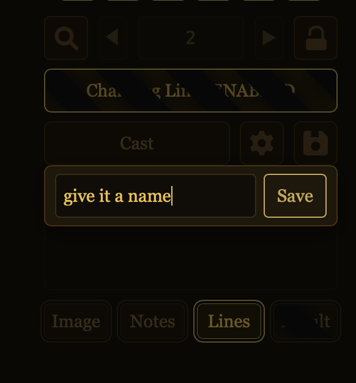
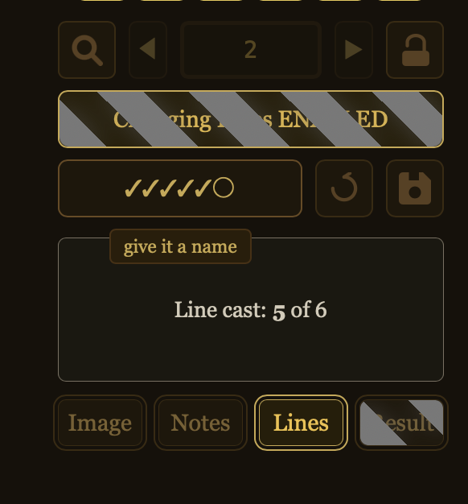

Find the Result tab button (the 4th double border button) at the bottom, click on it and you will see this:

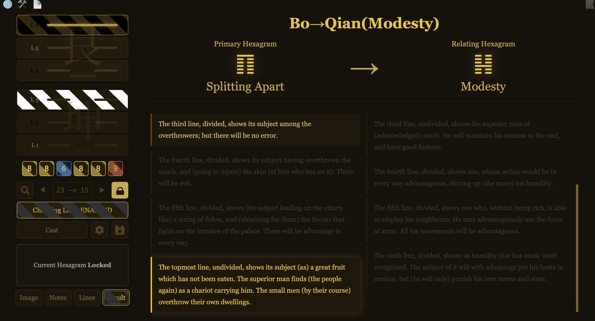

### 3. 📝 Text Edit
Simply click 📝 button at the top right corner to modify the body texts of the current hexagram. You can add notes, modify classical texts, and do text formatting.

Note that &0& /0&, &1& /1& etc. can dim texts that are unrelated to a cast result when changing-line mode is on (except Result tab). 

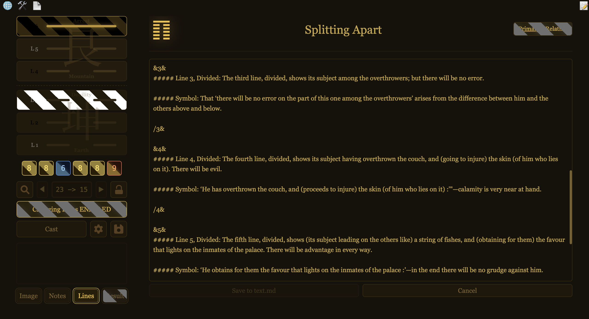

### 4. 🌠 Inserting Images
You can customise the image file paths following the examples in Image tab of Hexagram 2.

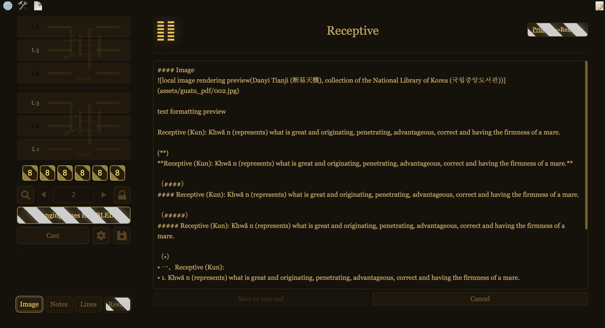

### 5. 💾🔍 Save & Reload Any Hexagram in 2 Clicks
You can see the hexagram you saved in the 🔍 button on the left. 

To load a hexagram instantly, click on the one your what in the dropdown section. (not on the 3 symbols)

To delete a record, click ✖

To rename or add notes to a record, click ✎

To favo a record, click ☆

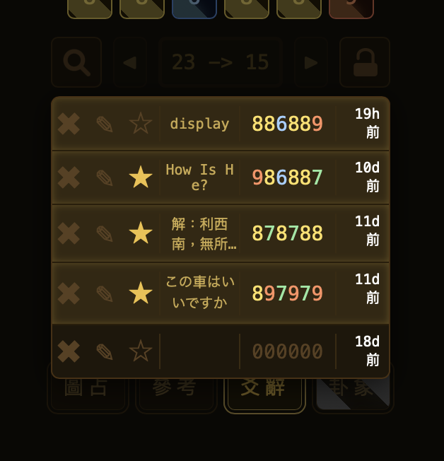
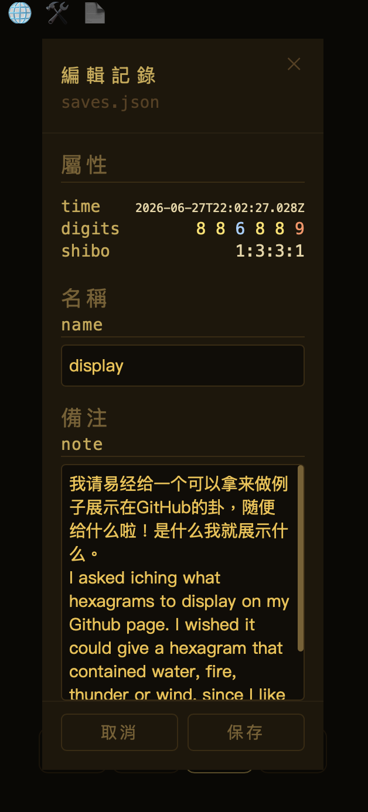

There are 2 ways to save a hexagram:

1- Cast, it is done automatically upon cast complete

2- Through 💾 Save button, it will save the one currently on the hexagram display above.

### 6. 📚 Complete I Ching Texts Built-in
Here are what each tab has by default:

tab1(Image): None. However it has a picture that can from a book published in late 16th century.

tab2(Notes): Xu Gua (The Orderly Sequence of the Hexagrams) & Za Gua (Treatise on the Hexagrams taken promiscuously)

tab3(Lines): the main I Ching texts, Tuan (Treatise on the Thwan), Xiang (Treatise on the Symbolism), Wen Yan (Supplementary to the Thwan and Yâo)

guaxiang tab(Result): only main I Ching texts.

the Shuo Gua (Treatise of Remarks on the Trigrams) is in the background of the hexagram display. Notice how the background texts change when switching among different tabs. You can control which "property" to show by clicking the 🛠️ button on the top left (explained in Feature 8).

Sources:
- James Legge, *The Yi King* (Sacred Books of the East, Vol. XVI), 1899
  - Hexagrams I–LXIV: [Sacred_Books_of_the_East/Volume_16/Hexagram_1](https://en.wikisource.org/wiki/Sacred_Books_of_the_East/Volume_16/Hexagram_1) .. [/Hexagram_64](https://en.wikisource.org/wiki/Sacred_Books_of_the_East/Volume_16/Hexagram_64)
  - Appendices (Tuan, Xiang, Wen Yan, Shuo Gua, Xu Gua, Za Gua): [Sacred_Books_of_the_East/Volume_16](https://en.wikisource.org/wiki/Sacred_Books_of_the_East/Volume_16)
(I actually forgot which website I copied the texts from, but surely it's written by James Legge)

Please let me know if you think any other version is better than the one here. Honestly I think James' version is good, but missing some caveats.

See Feature 7 if you want to import your own materials in the app. 

### 7. 📄 Import/Export Data
Click the 📄 at the top left corner and you will see the following:

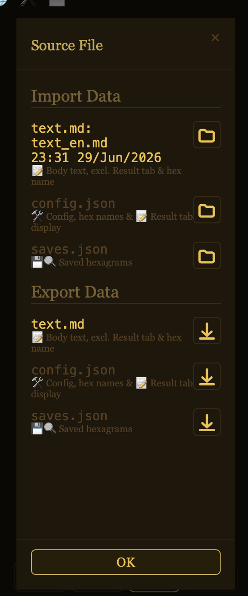

Click the 📂 import button to select a file locally. Then file name and the date of your import will be shown. If you never edit them in the app, the file name and the date will stay there forever, even after reopening the app.

Here are the files to import. You can see how the files are formatted and create your own:

[text_en.md](lan_English/text_en.md)

[config_en.json](lan_English/config_en.json)

[saves_samples.json](saves_samples.json)

All the data will be stored locally on your browser and you can still see them next time you open it. That also means if you are in private mode or clear the broswer data, the data will be gone.

You can download the current data from the app by click the ⬇️ export button. This allows you to keep the data and transfer them to a different place.

### 8. 🛠️ Customisations
Click 🛠️ and you will find lots of customisable features. 

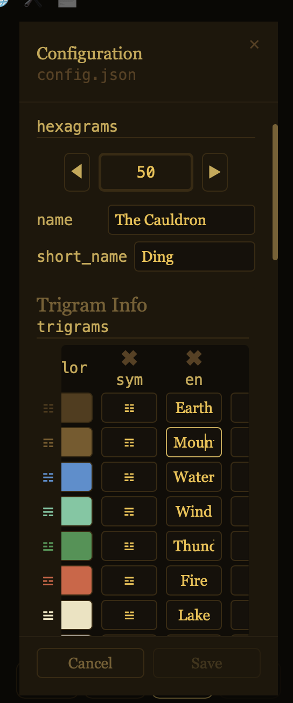
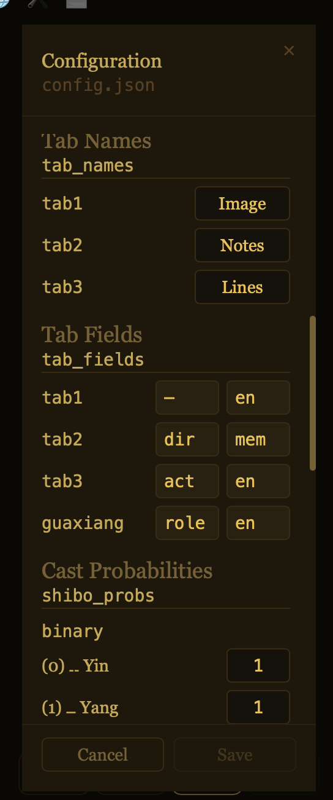
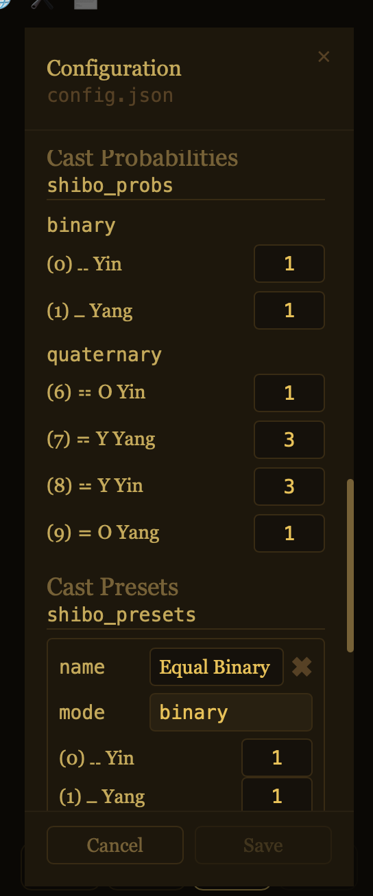

### 9. 📱 On Mobile Phone
The app is designed to fit into windows with different size, regardless of the language mode (and it took me plenty of time to make it work, spent more time than any other features).

On mobile phone you can use the app in protrait mode like this. 

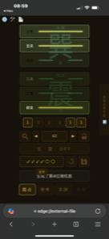

Note that on iOS, it cannot be launched on Safari. You can download the Microsoft Edge, then locate the .html and click "share":

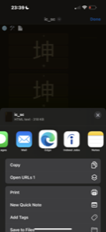

### 10. ䷋䷊ Hexagram Transformations
You can check what the hexagram can be transformed into through this button:

Can see the "Original" or "Current" button to the right of the hexagram's title? That is the one I am talking about. The button function differently when changing-line is ON or OFF.

When Changing-Line is OFF, by toggling the button, the content section will display the info of the:

Opposite Hexagram, all 0s flipped to 1s and vice versa

Inverse Hexagram, the order of the line is reversed, 1st to 6th -> 6th to 1st

Swap Hexagram, upper trigram swapped with lower trigram

Nuclear Hexagram, lower trigram takes the values of the original L2,3,4, whereas the upper trigram takes the values of the original L3,4,5