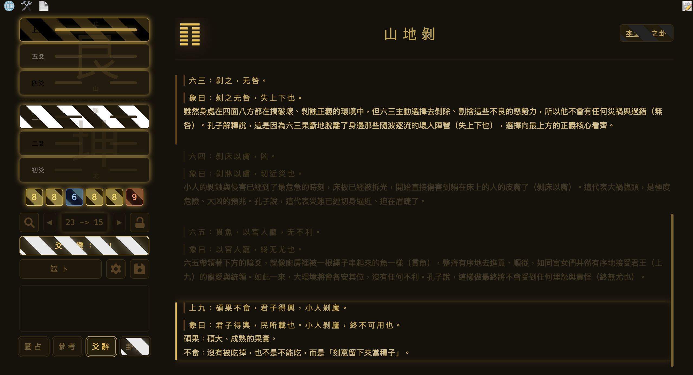
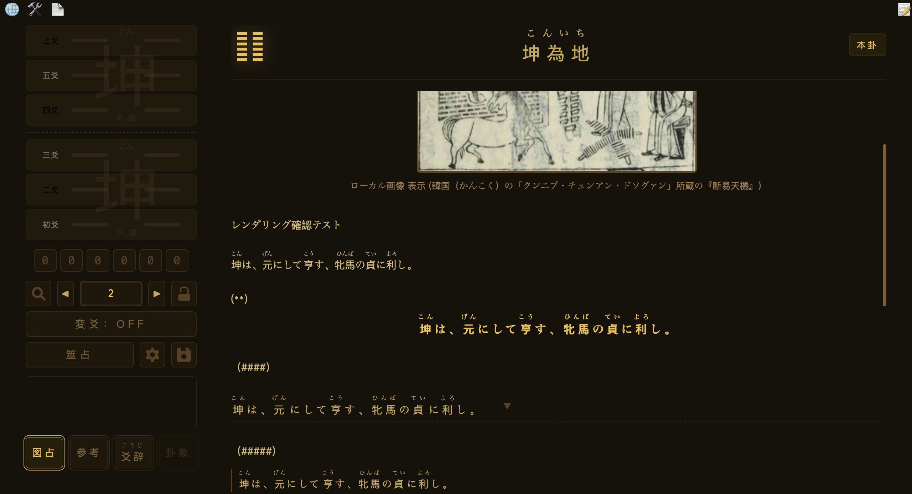
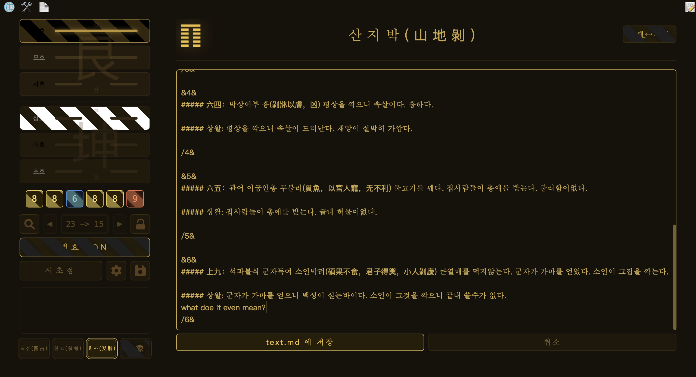

# 易經筆記本/易经笔记本/I Ching Notebook/易経ノート/주역 노트

選擇語言 / 选择语言 / Select your language / 言語選択 / 언어 선택

| Language | |
|---|---|
| 繁體中文 | [README.tc.md](README.tc.md) |
| 简体中文 | [README.sc.md](README.sc.md) |
| English | [README.en.md](README.en.md) |
| 日本語 | [README.ja.md](README.ja.md) |
| 한국어 | [README.ko.md](README.ko.md) |

圖片/图片/Image/画像/이미지

