[繁體中文](README.tc.md) | [简体中文](README.sc.md) | [English](README.en.md) | [日本語](README.ja.md) | [한국어](README.ko.md)
以下是简体中文版，给使用中文简体的人看的内容。

# 易经笔记本 - 兼备文字编辑功能（做笔记）和简易占卜功能的易经学习工具

子曰："书不尽言，言不尽意。"

这就是这个程序与其他易经相关的APP和开源程序不同之处的来源。

正因言不尽意，所以要用于实际生活中加以体会，其过程中领悟到的可以记笔记。笔记最好以自己能明白的方式表达，毕竟别人写的再怎么好，如果不是你的经历可以体会到的，对于你来说这些文字完全是另外的味（不同于原作者的本意）。

笔记本有许多可以自定义的功能，插入图片，默认文本内容包含易经9翼的内容（无《系辞传》），下载后无需上网。

这个程序虽是主打像一本方便查询的笔记本，但是仍加上了占卜功能，作为易经实践的一部分，只不过只有最基础的占法，至于什么结合六神之类的后人发明的占法以后考虑。

以前我只会C#和Matlab的代码，这是我的第一个JS/CSS程序，难免有问题，欢迎指正。代码基本是Claude Code写的，时间都花在设计交互逻辑，不断微调视觉效果上。（如果你看到易经相关的应用是这样配土黄色的，基本是AI的馊主意，因为我的就是基于AI推荐的颜色微调的。）还有这个程序只在macOS和iOS（用手机版Edge浏览器）上测试过，如果有在不同操作系统使用的只管给反馈，我将不胜感激。

## 目录

- [程序介绍 - 基础](#程序介绍---基础)
  - [下载](#下载)
  - [卦的信息查询](#卦的信息查询)
  - [占卜](#占卜)
  - [文字编辑](#文字编辑)
  - [手机使用](#手机使用)
- [程序介绍 - 自定义](#程序介绍---自定义)
  - [语言选择](#语言选择)
  - [文本导入/导出](#文本导入导出)
  - [占卜概率修改](#占卜概率修改)
  - [自定义设置](#自定义设置)
  - [查看錯卦，綜卦，交卦，互卦](#查看錯卦綜卦交卦互卦)
  - [《说卦传》去哪了呢？](#说卦传去哪了呢)
  - [卦象页面的爻辞点亮自定义 —— 未实现](#卦象页面的爻辞点亮自定义--未实现)

## 程序介绍 - 基础

### 下载

直接可用的版本，里面有提前加入的简体中文默认内置内容文本，下载下来然后点击即可使用： [ic_sc.html](ic_sc.html)

图片都在[assets](assets)文件夹里，需要下载[assets](assets)文件夹到和程序同一个本地位置里才可以读取。

内容文本来源（《周易》原文及十翼均为公有领域）：
- 简体中文正文：[中国哲学书电子化计划 ctext.org](https://ctext.org/book-of-changes/zhs)

如果不怕麻烦，可下载文本空白的原版，只有200多kB（需要手动导入文本数据，要看 程序介绍 - 自定义 的内容）：[ic.html](ic.html)

代码里唯一不同只是这几个参数：

const _EMBEDDED_CONFIG

const _EMBEDDED_HEX

const _EMBEDDED_SAVES

const DEFAULT_LANG

### 卦的信息查询
卦的按钮：阴阳符号，还有这些数字都是按钮，按了就会调取不同卦的信息。

爻变按钮：按了之后，以上的按钮就会出现多两种形态，阳变阴，和阴变阳，数字由0和1，变成6789，占卜的都知道6789是什么意思吧。在6789状态时，会到处看到 \ \ \ \ 的特效。

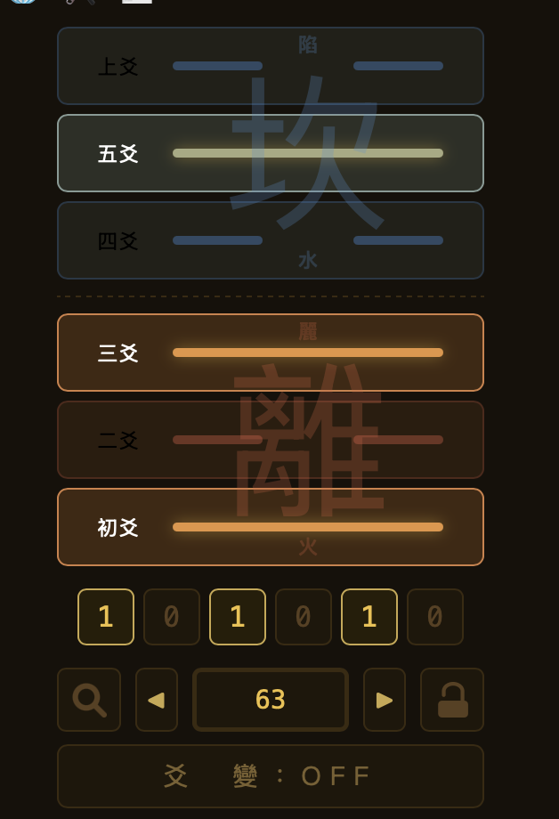
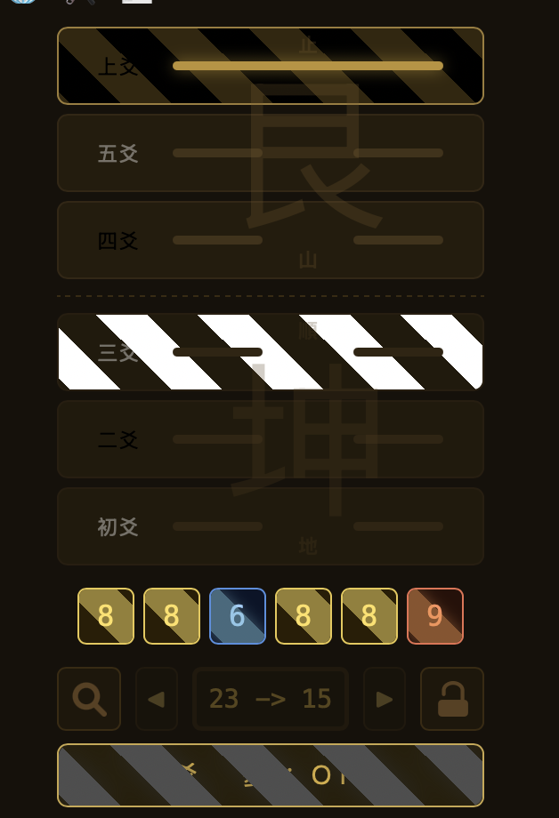

底下的页面选择按钮：4个双重边框的，其中第四个是“卦象”，显示变爻前后，只有在6789模式才可以打开。

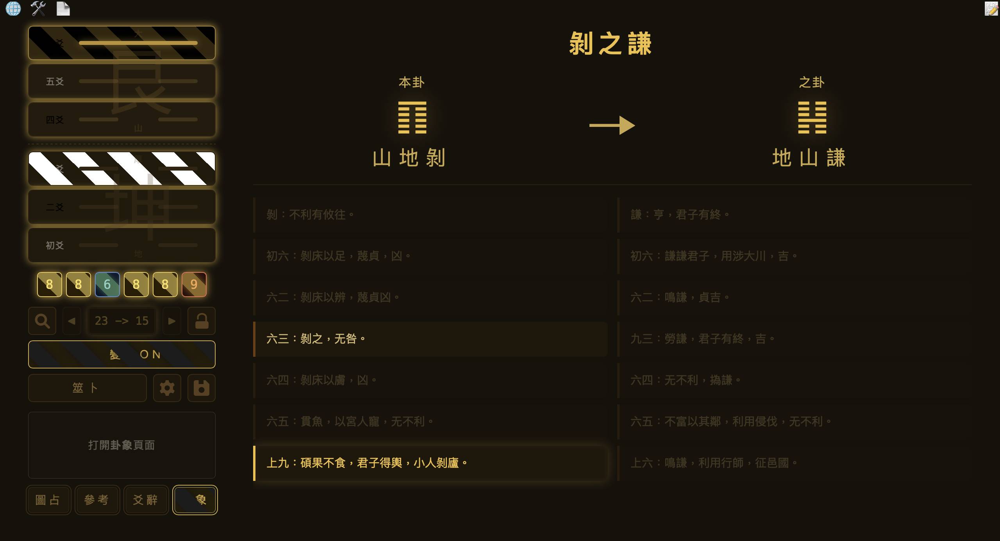

### 占卜
点击“筮卜”按钮，先输入命名，然后按6次即可完成，系统自动展示产生的卦并有发光特效。同时自动保存，以后可点击🔍加载。查看概率请看 程序介绍 - 自定义。

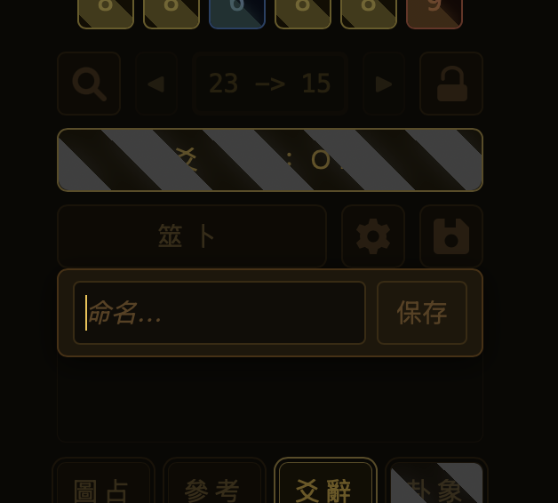
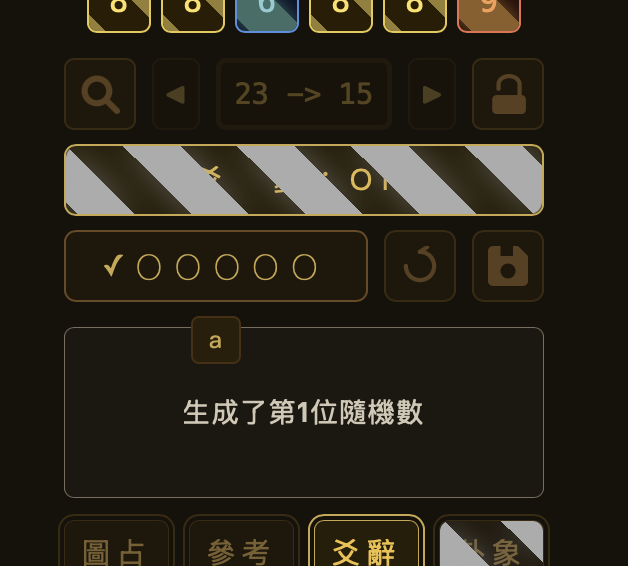

### 文字编辑
点击右上角的📝按钮，按了就可以编辑文本了，记得按右栏下面的“保存”键。

文本数据会保留在浏览器里，以Local Storage的形式。删除浏览器数据会删除全部文本。永久保存数据请看 程序介绍 - 自定义。

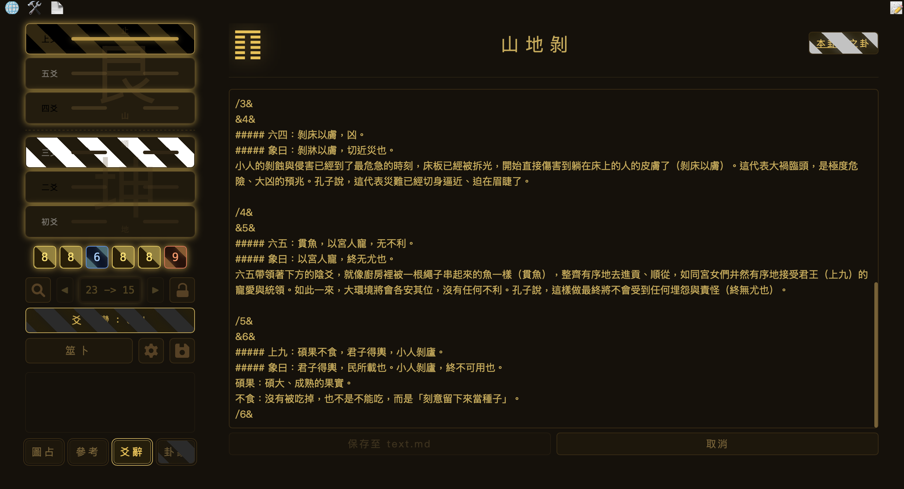

可以有不同样式的字体，和图片。参考坤为地的“图占”一栏的文本内容：

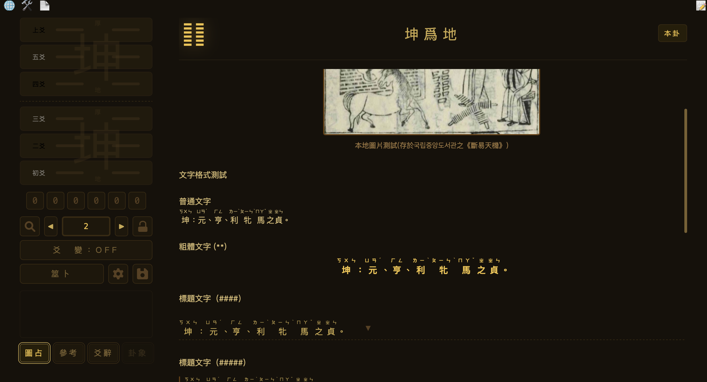

### 手机使用
这个程序手机也可以用，就是麻烦了点。竖屏时左栏和右栏挤不下，就靠中间的按钮来回切换。

iOS的默认浏览器Safari不给打开本地的html文件，所以要下载Edge，然后在点这个html文件然后点击分享，找到Edge的选项然后选择用Edge打开。

## 程序介绍 - 自定义

### 语言选择
左上角的🌐可更改语言，但是只会改系统语言（部分按钮的字和系统信息），不会改正文的字。要更改正文请看下面。

### 文本导入/导出
按左上角的📄，你会看到：

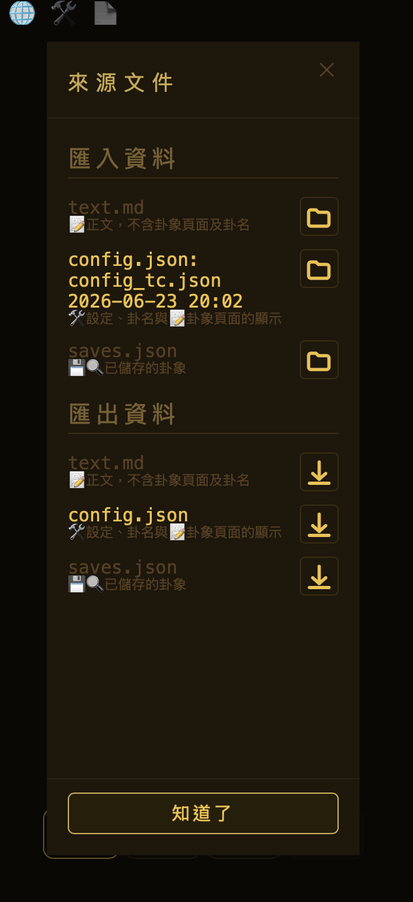

其中：
text.md 是属于正文内容，笔记的部分。

config.json 是自定义设置，可以在🛠️里查看

saves.json 是保存的卦象，每条都是一个6位数字，在下面的🔍查看

导入：点击📁即可选择在本地的文档，文件要符合格式要求。

加载后会显示文件名和时间。这些显示会持续到程序里的文本被通过📝🛠️💾🔍修改为止。

导出：下方有导出键，下载下来之后，浏览器数据清空或者换设备都无妨，只要导入这些文件即可。

默认可用于导入的文件：

[text_sc.md](lan_简体中文simplifiedChinese/text_sc.md)

[config_sc.json](lan_简体中文simplifiedChinese/config_sc.json)

[saves_samples.json](saves_samples.json)

### 占卜概率修改

占卜按钮旁有⚙️按钮，点击之后可以查看当前概率，点击预设还可以选择不同的概率。默认是1:3:3:1，模拟三铜钱，可以选择易经《繁辞传》描述的揲蓍法，概率1:5:7:3 。甚至可以自创概率预设，在🛠️创建。

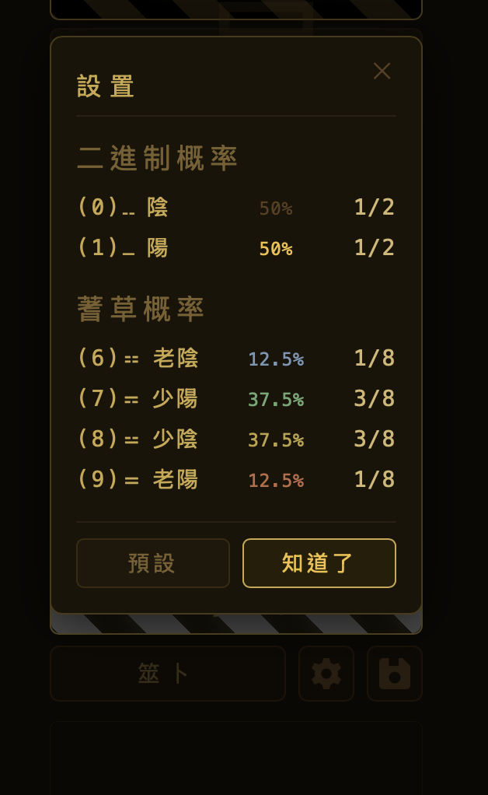
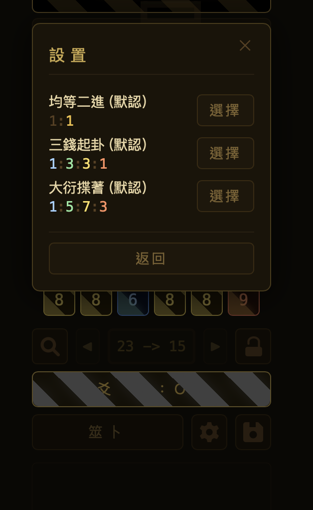

### 自定义设置

上下卦的颜色不喜欢？上下卦的背景小字要换掉？页面按钮的名称想修改？甚至64卦的卦名不合你意？全在🛠️里。

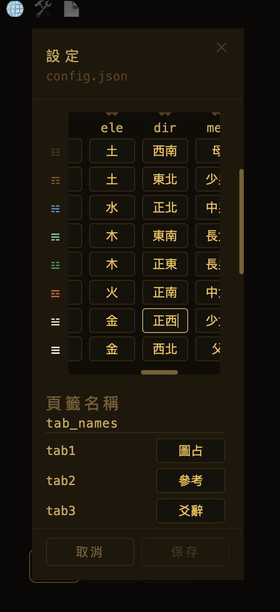

### 查看錯卦，綜卦，交卦，互卦

爻变没启用时，界面右上方有个”本卦“按钮，按一次就切换到错卦的信息，再按再切换，在本卦，错卦，综卦，交卦，互卦之间切换

### 《说卦传》去哪了呢？

说卦传并没有以大段文字显现。仔细看左栏的上下卦的小字，不同页面会展示不同的小字。🛠️里可以看到来自说卦传的八卦特性。自定义特性所展示的页面就更改如下部分：

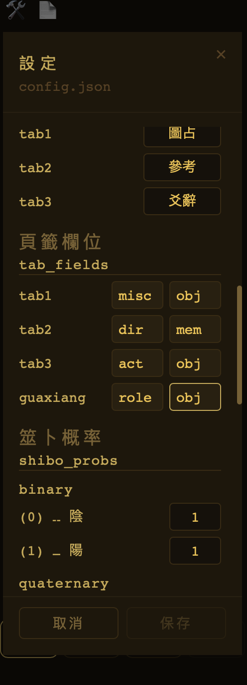

### 卦象页面的爻辞点亮自定义 —— 未实现

未实现。目前是依据 https://www.eee-learning.com/content/7 来控制点亮逻辑。以后在🛠️可以自定义。
